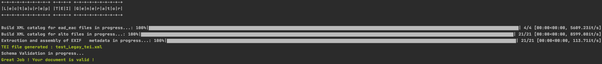

# Generator Lectaurep-TEI 

## Description

Author : Lucas Terriel @lterriel
reviewers : Alix Chagué @achague

Generator Lectaurep-TEI est un CLI (*Command Line Interface*) écrit en Python3 pour créer un format pivot XML TEI à partir des fichiers XML EAD, XML EAC-CPF, XML ALTO
et des IMAGES au format .jpg (métadonnées EXIF extraites) rentrés par l'utilisateur.

Le document XML TEI de sortie est basé sur deux scripts de transformation XSLT qui répondent à la modélisation de la template TEI et à l'ODD du projet LECTAUREP disponible dans le dossier `Doc/Modélisation_et_schémas_de_validation`

A noter que vous pouvez égallement utiliser des XML PAGE, préalablement transformé via la feuille de style XSL (author : Transkribus) disponible dans le dossier `Doc/crosswalks_vers_TEI/Page2Alto.xsl`

Le document XML TEI est actuellement conforme et valide du point de vue du schéma RelaxNG TEI-ALL.

## Installation 

1. Installer generator Lectaurep-TEI à partir de la branche master du dépôt Documentation Gitlab :
`$ git clone https://gitlab.inria.fr/almanach/lectaurep/documentation.git `

2. Installer Python via le [site](https://www.python.org/downloads/). Pour rappel : la plupart des systèmes Linux, intègre déjà Python.

3. Créer un environnement virtuel à l'aide de VirtualEnv. Dans votre terminal, taper la commande : `$ pip install virtualenv` pour installer VirtualEnv puis `$ virtualenv -p python3 env` ou sous windows : `$ virtualenv -p` puis `$ env:python3 env`

4. Activer l'environnement virtuel via `$ source env/bin/activate`. Pour quitter l'environnement taper simplement `$ deactivate`.

5. Dans le terminal, se placer au niveau du fichier `requirements.txt`, puis installer les différents packages nécéssaires avec la commande suivante : `$ pip install -r requirements.txt`.

Vous pouvez également utiliser conda pour créer votre environnement virtuel.

## Usage

Dans le terminal, rentrer la commande `$ cd generator_Lectaurep2TEI/`

exemple:

[] signifie commande optionnelle 

`$ python 3 main.py [-h] --images <path-to-IMAGES> --ead_eac <path-to-EAD_EAC> --alto <path-to-ALTO> --output
              <name-output-tei-file> [--rng <path-to-RelaxNG-Schema>]`

Notes :

- Donner le nom des chemins entiers et non relatifs, sans oublier le '/' final; 
- Pour la sortie (output) xml, n'oublier pas de donner l'extension ".xml" au nom de fichier. Par défaut, la sortie xml 
est donnée dans le fichier `Output/`;
- La validation avec `--rng` est facultative. vous pouvez utiliser le schéma `tei_all.rng` disponibles dans le dossier `generator_Lectaurep2TEI/pack_xmleadeac_schemaRNG`;
- Pour faire un test, vous pouvez utilisez les fichiers disponible dans le `generator_Lectaurep2TEI/Set_test_Legay`;
- les catalog.xml se créent et se remplacent automatiquement lors de l'execution du programme.

## Capture du programme

