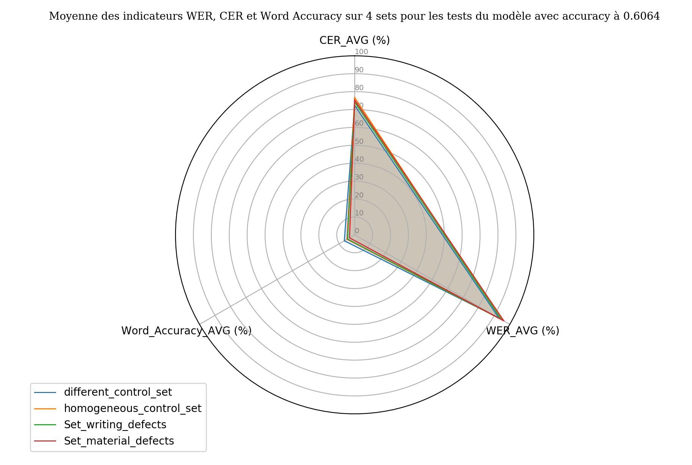
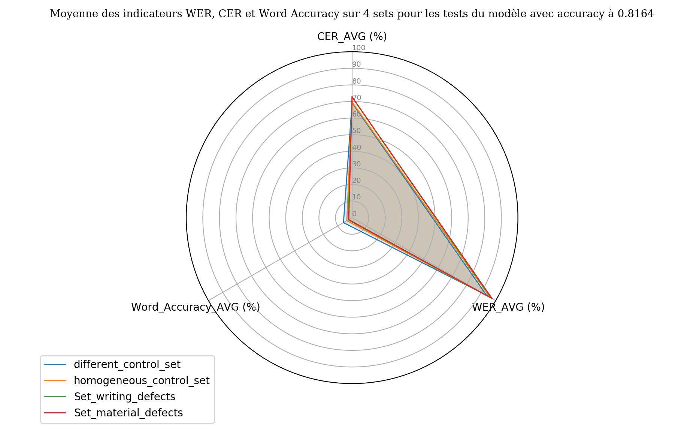

# Compte-rendu des tests sur le corpus de répertoire de notaires avec Kraken-Benchmark pour Lectaurep

Date : 06/08/2020

Auteur du compte-rendu : Lucas Terriel

## Objectifs des tests

Ces tests ont pout but d'évaluer les résultats de la transcription sur des corpus de répertoires de notaires choisis. 
On utilise l'application Kraken-Benchmark pour réaliser ces tests. 

### Problématiques 

- *La qualité de la numérisation, de la graphie des scribes, ou l'altération matérielle du corpus ont-ils un impact significatifs
sur les résultat de transcription issu du système OCR Kraken ?*

- *Les résultats obtenus permettent-ils de caractériser une méthode ou préconiser
des paramètres ou des directives pour améliorer l'entraînement des futurs modèles de transcription de Lectaurep ?*

## Contexte et matériel des tests

- Pour réaliser ces tests nous utilisons l'application Kraken-Benchmark dévellopé dans le cadre du projet Lectaurep.

Ce programme CLI et application web compare un document de vérité terrain (Ground Truth) avec le document qui provient du résultat OCR effectué par l'API Kraken durant le processus d'execution de l'application Kraken-Benchmark. Le résultat présente un dashboard HTML de métriques de type text-to-text et de type similarité sémantique.

- Les **modèles** (format mlmodel) de transcription utilisés ont été entraînés à partir du système OCR Kraken par Alix Chagué et Floriane Chiffoleau, ingénieures à INRIA, il s'agit des modèles : 

1. model_test_lectaurep_bin_accuracy_6064.mlmodel
2. model_test_lectaurep_bin_accuracy_8164.mlmodel

*Pour plus de détails sur ces modèles Cf.description_model.txt*

- **4 sets de tests** ont été spécialement constituer pour réaliser ces tests, ils sont accompagnés de leurs transcriptions GT au format .txt, il s'agit de : 

1. **different_control_set** : Set témoin comportant des images n'ayant subit aucune interférence lors de la numérisation du corpus, présentant
des graphies régulières, une présentation des écritures répartie dans les colonnes du tableau de manière homogène, sans altération matérielle apparente des répertoires
de notaire. Les images numérisées *proviennent de différentes études de notaires*. Images composant le set :

- temoin_1_legay_FRAN_0025_0037_L-0.jpeg (couleur, étude XXIII, notaire Ernest Legay)

- temoin_2_rigault_FRAN_0187_16414_L-0.jpeg (couleur, étude LXXXVI, notaire Jean-Paul Rigault)

- temoin_3_marotte_FRAN_0148_3268_L-0.jpeg (couleur, étude XLIII, notaire Louis Marie Joseph Marotte)

2. **homogeneous_control_set** : Set témoin comportant des images n'ayant subit aucune interférence lors de la numérisation du corpus, présentant
des graphies régulières, une présentation des écritures répartie dans les colonnes du tableau de manière homogène, sans altération matérielle apparente des répertoires
de notaire. *Provenant de la même étude XLIII du notaire Louis Marie Joseph Marotte*. Images composant le set :

- temoin_1_marotte_FRAN_0148_3270_L-0.jpeg (couleur)

- temoin_2_marotte_FRAN_0148_3268_L-1.jpeg (couleur)

- temoin_3_marotte_FRAN_0148_3268_L-0.jpeg (couleur)

3. **Set_writing_defects** : Set composé d'images de répertoires comportant des éléments de graphies
atypiques (police de caractère, signes et symboles). 

- subject_1_dufour_DAFANCH96_048MIC07685_L-0.jpeg (noir et blanc, étude XLVIII, notaire Jean Dufour)
-> élément atypique : une double flèche dans le coin inférieur gauche du répertoire au niveau de la colonne 1.

- subject_2_rigault_FRAN_0187_16428_L-1.jpeg (noir et blanc, étude LXXXVI, notaire Jean-Paul Rigault)
-> élément atypique : signe situé au niveau du chiffre "25" de la colonne 6 correspondant aux "dates". Dans le GT, ce signe est transcrit par un crochet carré : ], en partant du principe que les accolades }
se rencontrent plus souvent que les crochets dans les répertoires, et qui se segmente verticalement, de haut en bas s'il faut le tracer à la main.

- subject_3_dufour_DAFANCH96_048MIC08733_L-1.jpeg (noir et blanc, étude XLVIII, notaire Jean Dufour)
-> graphie atypique : Calligraphie un peu fracturée dans la cinquième colonne 

4. **Set_material_defects** : Set comportant des images de répertoires comportant des défauts de numérisation ou
des dégradations matérielles. 

- subject_1_robin_DAFANCH96_048MIC04695_L-1.jpeg (noir et blanc, étude XLVIII, notaire Jean-François Robin)
-> Tâche d'encre en marge, noirceurs sur les bords et forts contrates en rapport avec la numérisation.

- subject_2_rigault_FRAN_0187_16416_L-1.jpeg (couleur, étude LXXXVI, notaire Jean-Paul Rigault)
-> ruban adhésif sur la partie inférieure droite du document obstruant une partie des colonnes 6 et 7.

- subject_3_michaux_DAFANCH96_MIC067000672-1.jpeg (noir et blanc, étude VII, Pierre Michaux)
-> Gros ruban adhésif obstruant une partie du texte dans les colonnes 1, 2, 3, et 4.

**Notes sur les sets de tests** : 

- Les relevés des images présentant des particularismes dans le golden set au niveau matériel ou des graphies ont été réalisés par Aurélia Rostaing;
- Les transcriptions vérité terrains ont été réalisés par les agents du Minutier central des notaires de Paris aux Archives nationales (Virginie Grégoire, Benjamin Davy, et Danis Habib);
- Les documents de vérité terrain en .txt, parfois récupérés au format XML ALTO dans la plateforme eScriptorium, on été extraits via un
script Python `alto2text.py`;
- Afin de conserver une régularité dans les tests, nous comptons 3 images par set et chacune des images est binarisées (passage en noir et blanc) lors du processus OCR de KRaken-Benchmark.
  

## Méthodologie des tests 

Pour effectuer ces tests nous allons successivement passer les documents de vérité terrains, les images avec les 
deux modèles de chacun des sets et relever les résultats dans la partie "Observations". 

Le dossier `./snaps_tests_lectaurep/` contient une capture HTML du dashboard pour chaque tests (`./snaps_tests_lectaurep/report_html`) et une capture de la confrontation du texte de référence et de la prédiction OCR pour le meilleur résultat de chaque tests (`./snaps_tests_lectaurep/versus_text_html`).

## Observations

I. **Série de tests avec le modèle model_test_lectaurep_bin_accuracy_6064.mlmodel**

**Test 1 :  different_control_set**

| Images | longueur de la référence (char) | longueur de la prédiction (char) | différence (char) | CER  | WER | taux de reconnaissance par mots |  Distance de Hamming  | Distance d'édition  | Indice de Jaccard | Similarité cosinus |
|--------|:--------------------------------:|:-------------------------------:|:-----------------:|:----:|:---:|:-------------------------------:|:----------------------|:--------------------|:------------------|:-------------------| 
| temoin_1_legay_FRAN_0025_0037_L-0.jpeg    | 4793 | 2472 | 2321 | 74.24% | 94.14%  | 5 % | rien | 3557 | 0.02 | 0.06
| temoin_2_rigault_FRAN_0187_16414_L-0.jpeg | 3693 | 2449 | 1244 | 67.8%  | 89.95 % | 10 %| rien | 2504 | 0.04 | 0.23
| temoin_3_marotte_FRAN_0148_3268_L-0.jpeg  | 2999 | 1799 | 1200 | 74.82% | 94.93 % | 5 % | rien | 2244 | 0.02 | 0.02

meilleur résultat (word accuracy) : temoin_2_rigault_FRAN_0187_16414_L-0.jpeg

moins bon résultat (word accuracy) : temoin_3_marotte_FRAN_0148_3268_L-0.jpeg 

Notes : 
1. reconnaissance partielle voir impossible par le système OCR; 
2. le moteur OCR a signalé des échecs pour certaines segmentation de lignes;
3. taux de reconnaissance par mots extrêment faible; 
4. la confrontation des textes pour le témoin 2 (meilleur résultat) a cependant réussi à reconnaitre certains noms de rue 
et ville ("Paris"), des noms de famille, et des déterminants cependant les résultats sont trop sporadiques et peine à reconnaitre des phrases entières; 
5. difficultés à grouper les dates (utilisation de lettres comme séparateurs par le système);
6. Trop de suppressions signalé par une distance d'édition trop élevé, la moyenne des 3 différences de caractère tourne autour de 1588 caractères supprimés; 
7. On note égallement l'apparition de suite de nombre en lieu est place des phrases dans la transcription OCR.

**Test 2 : homogeneous_control_set**

| Images | longueur de la référence (char) | longueur de la prédiction (char) | différence (char) | CER  | WER | taux de reconnaissance par mots |  Distance de Hamming  | Distance d'édition  | Indice de Jaccard | Similarité cosinus |
|--------|:--------------------------------:|:-------------------------------:|:-----------------:|:----:|:---:|:-------------------------------:|:----------------------|:--------------------|:------------------|:-------------------| 
| temoin_1_marotte_FRAN_0148_3270_L-0.jpeg    | 2460 | 2028 | 432 | 76.66 % | 94.42 % | 5 % | rien | 1886 | 0.03 | 0.09
| temoin_2_marotte_FRAN_0148_3268_L-1.jpeg    | 2389 | 2154 | 235 | 78.86 % | 94.58 % | 5 % | rien | 1884 | 0.02 | 0.15
| temoin_3_marotte_FRAN_0148_3268_L-0.jpeg    | 2999 | 1799 | 1200 | 74.82%  | 94.93 % | 5 % | rien | 2244 | 0.02 | 0.02

meilleur résultat : ex-aequo

moins bon résultat : ex-aequo

Notes : 
1. idem que pour le test 1;
2. reconnaissance pour des suites de 2 à 3 caractères max. correctes dans l'ensemble;
3. substitutions récurentes des caractères par des suites numériques, souvent liés à l'enchainement d'un mot et d'un nombre dans le GT ex. "le 15 mai 1915 " 958 4 Ct de mariage Arsac" (extrait du témoin 2).

**Test 3 : Set_writing_defects**

| Images | longueur de la référence (char) | longueur de la prédiction (char) | différence (char) | CER  | WER | taux de reconnaissance par mots |  Distance de Hamming  | Distance d'édition  | Indice de Jaccard | Similarité cosinus |
|--------|:--------------------------------:|:-------------------------------:|:-----------------:|:----:|:---:|:-------------------------------:|:----------------------|:--------------------|:------------------|:-------------------| 
| subject_1_dufour_DAFANCH96_048MIC07685_L-0.jpeg   | 1721 | 949 | 772 |  	75.88 % | 96.29 %  | 3 % | rien | 1306 | 0.02 | 0.01
| subject_2_rigault_FRAN_0187_16428_L-1.jpeg        | 4541 | 2606 | 1935 | 72.01 %  | 94.14 % | 5 %| rien | 3270 | 0.03 | 0.07
| subject_3_dufour_DAFANCH96_048MIC08733_L-1.jpeg   | 1987 | 1093 | 894 | 74.73 % | 93.09 % | 6 % | rien | 1485 | 0.02 | 0.04

meilleur résultat : subject 3

moins bon résultat : subject 1

Notes : 
1. reconnaissance de une à trois lettres maximum d'en un mot de sept caractères;
2. aucune phrase entière reconnue;
3. bonne reconnaissance des e, a, d, s, n, i, u, o (subject_3);
4. reconnaissance des capitalisations et accentuations partielles voir inexistante;
5. Impossible de visualiser si la double fleche du sujet 1 interfère dans la transcription OCR;
6. Le texte traversant plusieurs colonnes dans le sujet 2 a été source de confusion pour le système OCR;
7. Le sujet 3 obtenant les meilleurs résultats en cause une sortie OCR plus longue; 
8. confusions vis-à-vis de la graphie Fraktur, trop proche de l'écriture imprimé (tester un modèle de transcription d'imprimé ?)

**Test 4 : Set_material_defects** 

| Images | longueur de la référence (char) | longueur de la prédiction (char) | différence (char) | CER  | WER | taux de reconnaissance par mots |  Distance de Hamming  | Distance d'édition  | Indice de Jaccard | Similarité cosinus |
|--------|:--------------------------------:|:-------------------------------:|:-----------------:|:----:|:---:|:-------------------------------:|:----------------------|:--------------------|:------------------|:-------------------| 
| subject_1_robin_DAFANCH96_048MIC04695_L-1.jpeg   | 982 | 842 | 140 | 79.53 % | 98.14 %  | 1 % | rien | 781 |  0.01 | 0.01
| subject_2_rigault_FRAN_0187_16416_L-1.jpeg       | 4403 | 2871 | 1532 | 70.81 %  | 92.54 % | 7 %| rien | 3118 | 0.04 | 0.1
| subject_3_michaux_DAFANCH96_MIC067000672-1.jpeg  | 1282 | 839 | 443 | 75.74 % | 97.76 % | 2 % | rien | 971 |  0.0 | 0.0

meilleur résultat : subject_2

moins bon résultat : subject_1

Notes : 
1. Trop de suppressions (constat sur la différence entre séquence de référence et séquence de prédiction); 
2. idem que pour les tests précédents, sous entrainement du modèle;
3. Le meilleur résultat (subject 2) est celui le moins altéré par le défaut matériel, mais trop de confusion et de bruits (Cf. snap versus text); 
4. reconnaissance d'une à deux lettres max dans un mot, ou des mots courts comme "rue". 
5. La plupart des transcriptions OCR restent illisibles et ininterprétables au vue du nombre de fautes. 

II. **Série de tests avec le modèle model_test_lectaurep_bin_accuracy_8164.mlmodel**

**Test 5 :  different_control_set** 

| Images | longueur de la référence (char) | longueur de la prédiction (char) | différence (char) | CER  | WER | taux de reconnaissance par mots |  Distance de Hamming  | Distance d'édition  | Indice de Jaccard | Similarité cosinus |
|--------|:--------------------------------:|:-------------------------------:|:-----------------:|:----:|:---:|:-------------------------------:|:----------------------|:--------------------|:------------------|:-------------------| 
| temoin_1_legay_FRAN_0025_0037_L-0.jpeg    | 4793 | 2554 | 2239 | 74.65 % | 95.78 %  | 4 % | rien | 3578 | 0.01 | 0.01
| temoin_2_rigault_FRAN_0187_16414_L-0.jpeg | 3693 | 2142 | 1551 | 70.7 %  | 95.22 % | 4 % | rien | 2611 | 0.02 | 0.01
| temoin_3_marotte_FRAN_0148_3268_L-0.jpeg  | 2999 | 2154 | 845  | 62.28 % | 89.86 % | 10 % | rien | 1868 | 0.07| 0.15

meilleur résultat : témoin 3

moins bon résultat : témoin 1 (proche du 2) 

Notes : 
1. Les taux de reconnaissance restent dans l'ensemble faible;
2. Le témoin 3 obtient les meilleurs résultats comme attendu puisque le modèle entrainé sur marotte, word accuracy ne dépasse pas 10% (la lecture à l'oeil reste très difficile même si
certains mots complexes comme des verbes, dates (sans enchainement) ou des noms propres voir des suites de 11 mots et chiffres max de petites longueurs sont reconnus comme "10, à Paris à Francois Mulaton, dt à Paris 117 rue" en témoigne le snap du versus text);
3. Encore trop d'insertions et de substitutions malgré des distances d'édition plus faible comparé au Test 1.

**Test 6 : homogeneous_control_set**

| Images | longueur de la référence (char) | longueur de la prédiction (char) | différence (char) | CER  | WER | taux de reconnaissance par mots |  Distance de Hamming  | Distance d'édition  | Indice de Jaccard | Similarité cosinus |
|--------|:--------------------------------:|:-------------------------------:|:-----------------:|:----:|:---:|:-------------------------------:|:----------------------|:--------------------|:------------------|:-------------------| 
| temoin_1_marotte_FRAN_0148_3270_L-0.jpeg  | 2460 | 2372 | 88 | 72.15 % | 96.48 %  | 3 % | rien | 1775 | 0.05 | 0.08
| temoin_2_marotte_FRAN_0148_3268_L-1.jpeg  | 2416 | 2516 | -100 (insertions) | 74.62 %  | 102.14 % | -2 % | rien | 1803 | 0.05 | 0.13
| temoin_3_marotte_FRAN_0148_3268_L-0.jpeg  | 2999 | 2154 | 845 | 62.28 % | 89.86 % | 10 % | rien | 1868 | 0.07 | 0.15

meilleur résultat : temoin 3

moins bon résultat : temoin 2

Notes : 
1. Ce set qui devait être le mieux noté, avec le modèle model_test_lectaurep_bin_accuracy_8164.mlmodel, en raison d'un entrainement spécifique avec Marotte obtient des résultats très décevants;
2. Comparé au test 2, le modèle reconnait plus de mots en témoigne la longueur des chaines. 
3. Le modèle semble présente un problème d'*overfitting*, en témoigne les nombreuses insertions pour le témoin 2, qui renvoie un WER supérieur a 1 et un word accuracy négatif.
4. En revanche, le témoin 3 obtient des meilleurs scores que dans le test 2 avec une augmentation du word accuracy de 5%. 

**Test 7 : Set_writing_defects**

| Images | longueur de la référence (char) | longueur de la prédiction (char) | différence (char) | CER  | WER | taux de reconnaissance par mots |  Distance de Hamming  | Distance d'édition  | Indice de Jaccard | Similarité cosinus |
|--------|:--------------------------------:|:-------------------------------:|:-----------------:|:----:|:---:|:-------------------------------:|:----------------------|:--------------------|:------------------|:-------------------| 
| subject_1_dufour_DAFANCH96_048MIC07685_L-0.jpeg   | 1721 | 879 | 842 | 73.91 % | 97.64 %  | 2 % | rien | 1272 | 0.0 | 0.0
| subject_2_rigault_FRAN_0187_16428_L-1.jpeg        | 4541 | 2527| 2014| 70.66 %  | 95.24 % | 4 % | rien | 3209 | 0.01 | 0.0
| subject_3_dufour_DAFANCH96_048MIC08733_L-1.jpeg   | 1987 | 961 | 1026| 73.52 % | 97.23 %  | 2 % | rien | 1461 | 0.01 | 0.03

meilleur résultat : subject 2

moins bon résultat : subject 1 et 3

Notes : 
1. reconnaisance illisible à l'oeil nu;
2. le système OCR peine a distinguer les accentuations; 
3. remplacement par des séries numériques là où il n'y a pas lieu;
4. impossible de distinguer si les particularismes entre en conflit avec la bonne la reconnaissance, trop de bruit de manière général.

**Test 8 : Set_material_defects** 

| Images | longueur de la référence (char) | longueur de la prédiction (char) | différence (char) | CER  | WER | taux de reconnaissance par mots |  Distance de Hamming  | Distance d'édition  | Indice de Jaccard | Similarité cosinus |
|--------|:--------------------------------:|:-------------------------------:|:-----------------:|:----:|:---:|:-------------------------------:|:----------------------|:--------------------|:------------------|:-------------------| 
| subject_1_robin_DAFANCH96_048MIC04695_L-1.jpeg    | 982 | 617   | 365 | 74.13 % | 98.76 % | 1 % | rien | 728  | 0.01 | 0.01
| subject_2_rigault_FRAN_0187_16416_L-1.jpeg        | 4658 | 2723 | 1935| 70.41 % | 94.95 % | 5 % | rien | 3280 | 0.02 | 0.0
| subject_3_michaux_DAFANCH96_MIC067000672-1.jpeg   | 1282 | 756  | 526 | 73.79 % | 98.66 % | 1 % | rien | 946  | 0.0  | 0.0

meilleur résultat : subject 2

moins bon résultat : subject 1

Notes : 
1. images d'origine noir et blanc ont tendance a être moins bien reconnus;
2. inacapacité à discerner si les particularismes entravent la bonne reconnaissance;
3. word accuracy trop faibles;
4. le meilleur est le sujet 2 d'origine couleur avec la plus légère altération matérielle, toutes proportions gardées au regard des autres résultats.

## Conclusion     

**Graphiques radars des deux modèles utilisés pour comparer les moyennes du WER, CER et word accuracy des sets durant les quatre tests 
(générés à partir de Matplotlib grâce au script `radar_graph.py`)**

    

    
 
 
 
 
 
 
 
 

* Le bilan de ces deux séries de tests est globalement très mitigé quand aux perspectives de récupération d'une transcription propre et lisible. Si l'on observe les deux radars ci-dessus les moyennes du WER, CER sont très fortes situés entre 70% et 100% et le taux de reconnaissance par mots (word accuracy) peine à dépasser la barre des 10%. Si on prend les images cumulées des quatre sets, la moyenne total de la chaine de caractère de référence est de 2854 caractères, la moyenne total du nombre caractères supprimés pour le modèle model_test_lectaurep_bin_accuracy_6064.mlmodel est de 1029 caractères supprimés par répertoires lors de la reconnaissance, soit un ratio de 0,36 et la moyenne total du nombre caractères supprimés pour le modèle model_test_lectaurep_bin_accuracy_8164.mlmodel est de 1015 caractères supprimés par répertoires lors de la reconnaissance, soit un ratio de 0,35. On remarque donc les résultats sont à la fois très faibles et en même temps très proches pour les deux modèles. 

* Durant les tests, certaines visualisations qu'offre Kraken-Benchmark n'ont pas pu être utilisés (classement des paires d'erreurs, et visualisations en signaux) en raison de la reconnaissance beaucoup trop faibles des images du système OCR, du nombre d'insertions et suppressions élevés (comme en témoigne les absences de distance de Hamming et les distances de Levenshtein importantes) et du bruit trop intense, qui provoque des décalages trop importantes entre les séquences de caractères. Seul le dashboard de métriques et la confrontation à l'oeil nu de la référence et de la prédiction avec l'option versus text ont permis de commenter ces tests. 

* Les modèles entrainés pour la transcription ne permettent pas, au regard des résultats, des traitements de type reconnaissance automatique d'entités précises (noms propres, verbes, lieux, type d'acte...) comme en témoigne les indicateurs de similarité sémantique avec l'indice de Jaccard (moyenne à 0.02 pour le modèle model_test_lectaurep_bin_accuracy_6064.mlmodel et moyenne à 0.03 pour le modèle model_test_lectaurep_bin_accuracy_8164.mlmodel) et la similarité cosinus. Si un texte avec un taux d'erreur inférieur à 20% est lisible pour l'oeil humain, des taux supérieurs à 70% sont non seulement illisble pour l'oeil et encore précis pour un traitement informatique. 

* Au coeur de ces réultats très faibles, des modèles sur-ajustés (*overfitting*) comme dans le cadre du modèle model_test_lectaurep_bin_accuracy_8164.mlmodel et sous-ajustés (*underfitting*) pour le modèle model_test_lectaurep_bin_accuracy_6064.mlmodel, pour lesquels nous pouvons prosposer quelques pistes pour l'amélioration de ces résultats et l'entrainement des modèles de transcription de Lectaurep :
 
-> Fixer un seuil d'accuracy pour les modèles >= 80 % et un objectif de word accuracy >= 50% lors des tests ultérieurs;
 
-> Normer et homogénéiser les pratiques de transcriptions *ground truth* en format texte, surtout en terme de lignes vides (conversion ALTO vers texte) pour récuppérer des résultats moins biaisés;
 
-> Conserver des numérisations couleurs qui sont ensuite binarisés par le système OCR;
 
-> Paramétriser l'entraînement des modèles avec des données plus nombreuses (150 images < set entrainement < n images) et plus hétérogènes (images de différentes mains, études de notaires, qualités matériels différentes) pour mieux représenter la variété des répertoires de notaires;
 
-> Proposer des campagnes de post-traitements des transcriptions OCR, pour rendre celles-ci plus lisibles, en utilisant un algorithme de correction automatique, basé par exemple, sur la tokenisation, supression des stops words (généralement bien retranscrits) et l'évaluation de la distance d'édition entre le mot de la transcription OCR par rapport à un dictionnaire préconfiguré à partir des mots de la transcription GT. 

